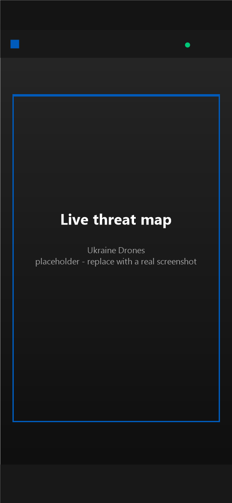
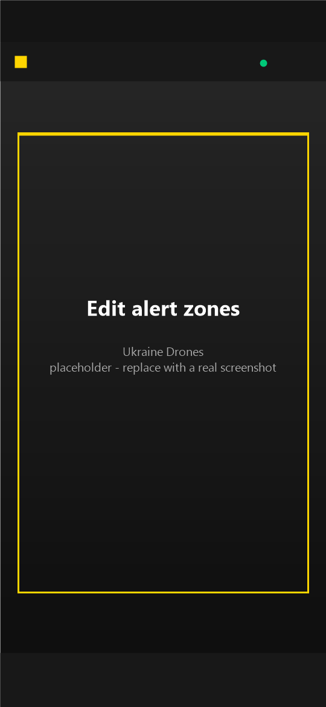
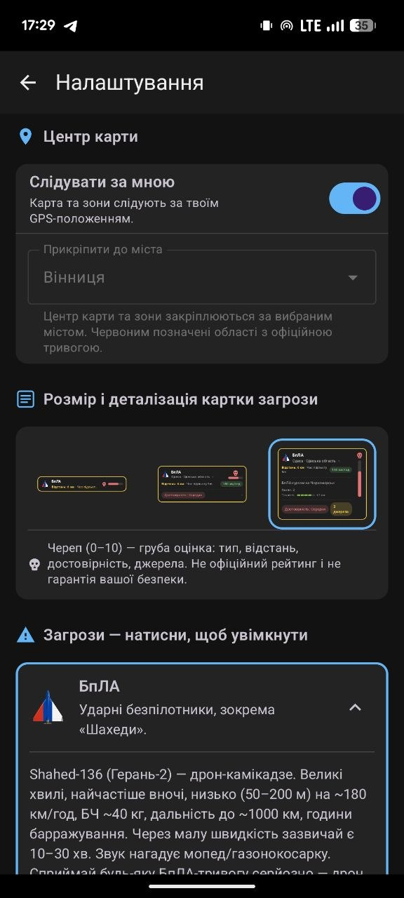
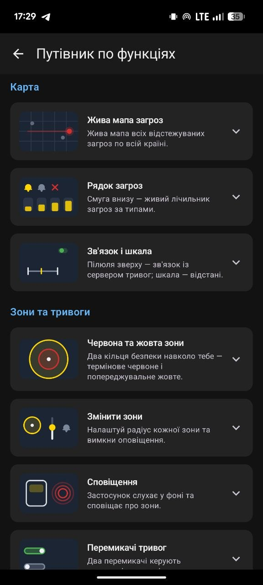

# Ukraine Drones · Українські дрони

**A live air-threat map for all of Ukraine.** It connects straight to the
[NEPTUN](https://neptun.in.ua) public API and rings alerts when threats come close —
drones, missiles, guided bombs, and more — right on your phone.

**No account. No server of ours. No API key.** The app talks directly to NEPTUN's public
WebSocket, tracks your (approximate) location on-device, and fires siren/chime
notifications from its own local background service.

## Screenshots

To replace a capture, run the app (e.g. in an emulator) and use
`adb exec-out screencap -p > docs/screenshots/<name>.png`, keeping the filename.

| Map | Edit alert zones |
| --- | --- |
|  |  |

| Settings | Feature guide |
| --- | --- |
|  |  |

## Features

- **Live threat stream** from `wss://neptun.in.ua/api/v1/stream` (with REST merge when the
  stream goes quiet), drawn over a dark OpenStreetMap-style base. No Google account or key.
- **Two alert tiers by time-to-arrival** — a Red tier (urgent, full siren) for threats that
  could reach you within the red time, and a Yellow tier (warning, two-tone chime) for those
  within the yellow time. Thresholds are adjustable in minutes (red 5–20, yellow 20–60).
- **Official oblast air-raid alerts** on their own — the trident glow in the header turns
  red while a government signal is active. Controlled independently in Settings.
- **Eight threat types** with vector icons, plain-language descriptions and reference
  photos: UAV (Shahed), FPV/loitering (Lancet), cruise missile, ballistic, guided bomb,
  aviation (MiG-31K), reconnaissance, unknown.
- **Threat detail cards in three sizes** (Small / Medium / Large, pick in Settings): type,
  region, an experimental 0–10 threat-level gauge, speed, distance/ETA, precision (±km),
  reliability with source count, wave size and time since last seen. Tap the map to dismiss.
- **Live city alerts** — city labels turn red while their oblast is on official alert and
  show active-threat counts (e.g. "Kharkiv (2)").
- **UA / EN** — English uses Canadian spelling and the 🇨🇦 flag; first launch asks your
  preference, or switch anytime in Settings.
- **Battery-cheap location** — coarse network fix only (~2 min / ~250 m), so the rings stay
  honest and the battery stays alive.
- **Monitoring keeps running in the background** — a foreground service keeps alerting while
  you use other apps, and restarts itself after a phone reboot or an in-app update.
- **Self-updating** — silent daily checks plus a manual button, with in-app install.

## How alerts work

Three independent alert sources, each with its own toggle:

1. **Red tier** — a threat that could reach you within the red time (default 20 min) triggers
   the urgent air-raid siren.
2. **Yellow tier** — a threat that could reach you within the yellow time (default 60 min)
   triggers a two-tone warning chime.
3. **Official oblast alert** — follows the government signal on its own; never mixed with
   the zone alerts.

Zone tiers follow your last location fix — or, when you pin the map to a city in Settings
(**Map centre**, 26 major cities), they centre on that city instead. "Follow me" keeps the
camera and zones on your GPS; pinning to a city switches it off and marks the city with a
map pin. Time thresholds are dragged in the **Edit zones** sheet (sliders update the map
circles live); each zone has its own bell + switch, and when both are muted a small "All
alerts are off" pill appears on the map.

Tiers are measured as time-to-arrival, so every object type is handled the same way — a fast
ballistic/cruise missile simply crosses a threshold sooner (and from farther out) than a
Shahed. The red/yellow circles on the map are a reference visual: how far a Shahed (180 km/h)
flies in that time.

Sirens respect your phone's sound mode by default — they ring at notification volume and
only vibrate on vibrate/silent. The **"Sirens always sound"** setting (off by default, in
Settings → Alerts) makes siren alerts ring even on vibrate/silent. When an official alert
ends, a short "all clear" chime plays; the all-clear always follows the phone's mode.

Alerting keeps working while you're in another app — a foreground `dataSync` service
monitors in the background. The **Stop Monitoring & Exit** button in Settings ends it.
Positions are deliberately **coarse-only**, and you'll see disclaimers that positions and
threat levels are approximate, never exact.

## What it deliberately does **not** do

- **No cloud anywhere** — no server of ours, no Firebase, no accounts, no billing. If the
  NEPTUN stream is down, the app keeps retrying silently; there's no intermediate service
  to buffer anything.
- **No precise GPS** — coarse location only, to save battery and respect your privacy.
- **No push infrastructure** — alerts are generated locally by the app's own foreground
  service, so they stop the moment you exit. This is a conscious zero-backend tradeoff.
- **Not an official alert system** — NEPTUN is an aggregator. Always defer to official
  sirens and government channels for actual safety decisions.

## Build from source

Requirements: JDK 17+ and the Android SDK (compileSdk 34).

```powershell
.\gradlew.bat :app:assembleDebug
adb install app\build\outputs\apk\debug\app-debug.apk
```

For a release build you also need `app/keystore.properties` (git-ignored) with
`storeFile`, `storePassword`, `keyAlias`, `keyPassword`, then run `.\gradlew.bat :app:release`.

## Architecture

Jetpack Compose + OSMdroid, Kotlin, coroutines + DataStore. Key files under
`app/src/main/java/ua/ukrainedrones/`:

- `NeptunClient.kt` — NEPTUN WebSocket with auto-reconnect (backoff) and REST merge.
- `MainViewModel.kt` — combines the threat stream, alerts and location into UI state.
- `MapView.kt` — OSMdroid rendering: zone circles, type-icon markers, course rotation,
  dead-reckoned positions, city labels, scale bar.
- `MainScreen.kt` — top-level Compose UI: header (trident, title, connection pill, gear),
  alert banner, map, threat strip, navigation.
- `SettingsScreen.kt` — language, Map centre, threat toggles/cards, alerts, updates,
  battery, feature guide.
- `ZonesSheet.kt` — "Edit zones" bottom sheet with live radius sliders.
- `AlertService.kt` — foreground service that rings siren/chime for zone crossings and
  official alerts; `BootReceiver.kt` restarts it after reboot/update.
- `LocationTracker.kt` — battery-cheap coarse GPS (network-first, ~2 min / 250 m).
- `Prediction.kt` — dead-reckoning: markers drift only while flying, using a real course.
- `Threat.kt` / `ThreatTypeCatalog` — data model and type catalog (labels, descriptions,
  icons in UA+EN, staleness windows, typical speeds).
- `ThreatLevel.kt` — the experimental 0–10 threat-level estimator.
- `Zones.kt` / `ZoneConfig` — zone definitions and point-in-polygon helpers.
- `Cities.kt` / `Translate.kt` — city alert coloring and NEPTUN locality translation.
- `UpdateManager.kt` — silent daily version checks + manual check, in-app install.
- `Strings.kt` / `ZonePrefs.kt` — UA/EN string table and DataStore-backed prefs.

## Attribution & safety

Per NEPTUN's API terms, the app links back to [neptun.in.ua](https://neptun.in.ua/). NEPTUN
is an aggregator, not an official alert system — always defer to official siren/alert
sources for actual safety decisions.
